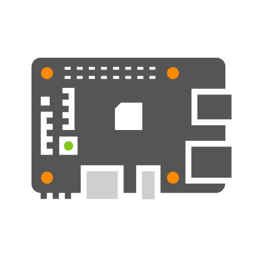

# Download live iso

## Architalia-live ISO

### Introduzione

Architalia-live e' una live per l'installazione di arch puro creato con archiso, mantiene la filosofia di arch conservando l'installazione manuale da console o degli script, ma aggiungendo una gnome-shell minimale che comprende pacchetti utili a l'utente.

E' possibile effettuare un installazione di arch tradizionale in console, con la possibilita' di poter leggere una guida sullo stesso schermo o di navigare per verificare qualcosa sulla archwiki, oppure effettuare altre operazioni di manutenzione in chroot sul proprio sistema arch. E' ovviamente possibile stabilire la connessione a internet in maniera tradizionale con l'implementazione del servizio networkmanager, attraverso gnome.

Tutte le guide della community architalia in PDF si trovano in `~/Guide`, Per creare la tua installazione puoi usare il metodo classico da riga di comando in console, oppure usare archinstall, per utenti esperti si puo usare lo script di architalia posizionato in `~/Installscript`. pacchetti aggiuntivi in questa live: git, firefox, evince, eog, console, nautilus, text-editor, etcher, gparted, gnome-system-monitor, gdm, gnome-shell.

### Download ISO

`[Architalia] 1.59 GB [Beta 3.0]`

In attesa della versione Beta 3.0

### Bugs

* [2023.06.30]  [Non Critico]  Tempo di Copia del filesystem rootfs in ram lungo. 
* [2023.06.30]  [Non Critico]  Tempo di avvio dell'ambiente desktop lungo. 

    

## Archiso

Sempre aggiornata, dal server Italiano archmirror.it
 
[Download](https://archmirror.it/repos/iso/latest/archlinux-x86_64.iso)

Verifica della firma

E' raccomandata la verifica della firma dell'immagine prima dell'utilizzo, specialmente se è stata scaricata da un mirror HTTP, dove i download possono essere soggetti ad intercettazioni per fornire immagini malevoli. Su un sistema con GnuPG installato, eseguire il comando seguente per scaricare la firma PGP ISO > nella directory col file ISO, e verificarla con:

`$ gpg --keyserver-options auto-key-retrieve --verify archlinux-version-x86_64.iso.sig`

In alternativa, da un'installazione esistente di Arch Linux eseguire:

`$ pacman-key -v archlinux-version-x86_64.iso.sig`

    

## VM image

Immagini ufficiali per macchina virtuale, l'immagine di base è pensata per l'uso locale ed è preconfigurata con (utente: arch - password: arch) e sshd in esecuzione.

[Download](https://gitlab.archlinux.org/archlinux/arch-boxes/-/jobs/artifacts/master/browse/output?job=build:secure)

    

## Docker

Immagine ufficiale Docker

`docker pull archlinux`

[Download](https://hub.docker.com/_/archlinux)

    

## ARM

Arch Linux ARM è una distribuzione di Linux per computer ARM

[Download](https://archlinuxarm.org/about/downloads)

    
